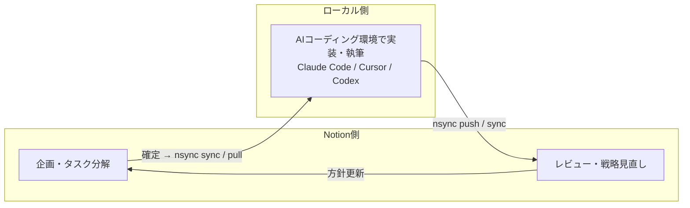

# Notion × AIコーディング環境 往復ワークフロー

nsync を使って **戦略・企画は Notion で、実装・執筆は ローカルのAIコーディング環境（Claude Code / Cursor / Codex など）で** 行い、成果を Notion に還流する循環ワークフローの方法論ガイドです。

このワークフローは特定のツールに依存しません。ローカルで動く AI エディタ（Claude Code / Cursor / Codex など）であれば、同じ「Notion で企画 → ローカルで実装 → Notion に還流」の往復が成立します。以下では総称して **ローカルのAIコーディング環境** と呼び、コマンド例は Claude Code のものを用います（Cursor / Codex でも同様に、それぞれのチャットから nsync を呼び出せます）。

このガイドは実際の運用実績に基づく部分（✅ **実証済み**）と、チーム規模等に応じた提案（💡 **推奨案**）を区別して書いています。

対象読者: Notion と ローカルのAIコーディング環境（Claude Code / Cursor / Codex 等）を併用する個人〜小チーム。特定のプロジェクト管理手法は前提にしません（AI-PLC を使っている場合は [Appendix](#8-appendix-ai-plc-フル運用との対応) 参照）。

---

## 1. なぜ環境を往復するのか

Notion とローカルのAIコーディング環境は得意分野が違います。

| | Notion | ローカル（Claude Code / Cursor / Codex） |
|---|---|---|
| 得意 | 共同編集・コメント・DB管理・モバイル閲覧・関係者へのレビュー依頼 | ファイル一括操作・grep/検索・コード実行・長文の集中執筆・大量ページの機械的編集 |
| 苦手 | 大量ページの一括編集、コードとの往復 | 関係者との共有・レビュー、構造化DBのビュー |

どちらか一方に寄せると必ず何かを失います。nsync の双方向同期を使えば、**フェーズごとに得意な環境へ移動する**運用ができます:

- **上流（企画・タスク分解）** → Notion。関係者と議論しながら固める
- **実行（実装・執筆）** → ローカルのAIコーディング環境（Claude Code / Cursor / Codex）。ローカルファイルとして高速に作業する
- **還流（レビュー・戦略見直し）** → Notion。成果を push で戻し、次の一手を考える

## 2. 循環ワークフロー全体像



1周のサイクルは次の4ステップです:

1. **Notion で企画する** — ゴール・タスクをページに書く（Notion AI との議論も有効）
2. **`sync` / `pull` でローカルに取り込む** — 企画ページとタスクが Markdown / SQLite になる
3. **ローカルのAIコーディング環境で作業する** — Claude Code / Cursor / Codex などでローカルの Markdown・コードを編集し、成果物を作る
4. **`push` / `sync` で Notion に還流する** — 関係者がレビューし、戦略を見直して 1 に戻る

## 3. 正本切替ルール（source of truth）

双方向同期で最も重要なのは「**今、どちらの環境が正か**」を常に1つに決めておくことです。両側で同時に編集すると競合（CONFLICT）が発生します（→ [§6](#6-競合回避の作法)）。

✅ **実証済み** — フェーズごとに正本を切り替える運用:

| フェーズ | 正本（編集してよい側） | もう一方の扱い |
|---|---|---|
| 企画・タスク分解中 | **Notion** | ローカルは参照のみ（編集しない） |
| 実装・執筆中 | **ローカル** | Notion は閲覧のみ（編集しない） |
| レビュー・振り返り中 | **Notion**（push 済みの状態） | ローカルは次の pull まで編集しない |

原則はシンプルです: **正本側でのみ編集し、フェーズが変わる瞬間に同期してから正本を切り替える。**

## 4. 同期タイミング規約

「いつ sync するか」を決めておくと、競合と取りこぼしがなくなります。

- **作業開始前に必ず `./nsync.sh sync`**（sync-before-work）。正本を切り替える前に最新状態を取り込む
- **フェーズ境界で同期する**: 企画確定時（Notion→ローカル）、作業の意味的な区切り・タスク完了時（ローカル→Notion）
- push は「こまめに」よりも「**レビューできる単位**」で。中途半端な状態を Notion に流すと、関係者のレビューコストが上がる
- 反映内容が不安なときは **`push --dry-run`** でプレビューしてから push する（構造検証付き）

✅ **実証済み** — ローカルで Markdown を編集して `nsync.sh push` する運用は、Notion 上で手作業転記するより大幅に速く、装飾属性（callout / toggle / 文字色）も往復で保持されます（子ブロック入り callout 等の既知の制限は [SKILL.md](../SKILL.md) 参照）。

## 5. 戦略見直しへの戻り方

実行フェーズをずっと続けるのではなく、**節目で Notion に戻って戦略を見直す**のがこのワークフローの核です。

戻るタイミングの目安:

- タスクの完了率が半分を超えたとき（当初の分解が現実とズレ始める頃）
- 全タスクが完了したとき（ゴールとのギャップ分析）
- 実行中に前提を覆す発見があったとき

戻る手順の型:

1. ローカルの成果を `push`（または `sync`）で Notion に還流する
2. Notion 側で成果をレビューし、企画・タスクページを更新する（追加タスク・方針転換を正本である Notion に書く）
3. `sync`（または `pull`）でローカルに再取り込みする
4. **既存の成果物は保持したまま**、更新された企画だけを取り込んで実行を再開する

✅ **実証済み** — 「Notion で企画を更新 → pull → 既存プロジェクトを壊さずに再初期化して続行」という手順は運用実績があります。ポイントは、戻ったときに **成果物を作り直さない**こと。変わるのは計画であって、できあがった成果物ではありません。

## 6. 競合回避の作法

nsync の `sync` は、同じページがローカル・Notion 双方で変更されていると **スキップして CONFLICT 警告**を出します（片方を黙って上書きしません）。

競合を起こさないために:

- **同時に両側で編集しない**（§3 の正本ルールを守る）
- **作業開始前に sync する**（sync-before-work）
- 💡 **推奨案** — チームで使う場合は「Notion 側を編集する人」と「ローカル側を編集する人」でページの担当を分ける

CONFLICT が出てしまったら、どちらを正とするか決めて解決します:

| 解決方法 | コマンド | 結果 |
|---|---|---|
| ローカル版を優先 | `./nsync.sh push <file>` | ローカルの内容で Notion を上書き |
| Notion 版を優先 | `./nsync.sh pull <file>` | Notion の内容でローカルを上書き |

上書きしてしまった場合も、Notion のページ履歴（ページ右上 `...` → バージョン履歴）から復元できます（履歴の保持期間は Notion のプランに依存します）。

## 7. Quick Start（最小構成）

プロジェクト管理手法なしでも回せる、最小の往復ループです。

```bash
# 0. セットアップ（初回のみ — README の「初期セットアップ」参照）
python3 .claude/skills/nsync/scripts/nsync.py init \
  "https://www.notion.so/myworkspace/My-Project-xxxx" "projects/my-project"
cd projects/my-project

# 1. Notion で企画メモを書く → ローカルに取り込む
./nsync.sh sync

# 2. ローカルのAIコーディング環境で作業する（Claude Code / Cursor / Codex — .md を編集・成果物を作成）
#    例（Claude Code CLI）: claude "企画メモをもとに提案書のドラフトを作って"
#    Cursor / Codex なら各チャットで同様に依頼する

# 3. 成果を Notion に還流する（プレビューしてから push）
./nsync.sh push --dry-run 提案書.md
./nsync.sh push 提案書.md

# 4. Notion でレビュー・企画を更新 → 1 に戻る
./nsync.sh sync
```

覚えることは3つだけです: **作業前に sync / 正本は常に1つ / push 前に dry-run**。

## 8. Appendix: AI-PLC フル運用との対応

[AI-PLC](https://github.com/miyatti777/ai-plc)（AIとの協働でプロジェクトを回す方法論）を導入している場合、このワークフローは AI-PLC の Stage 構造とそのまま対応します。

| AI-PLC Stage | 実施環境 | 同期アクション |
|---|---|---|
| Stage 1: Collection（ゴール設定・Context収集） | Notion（Notion AI） | 完了時に `pull` / `sync` でローカルへ |
| Stage 2: Inception（タスク分解） | Notion（Notion AI） | backlog 確定後にローカルへ |
| Stage 3: Construction（実行準備） | どちらでも | — |
| Stage 4: Operation（タスク実行） | ローカル（Claude Code / Cursor / Codex） | タスク完了・Propagation 時に `push` |
| Backtrack（節目再評価・GAP分析） | Notion | `push` で還流 → Notion で再 Collection → `pull` |

✅ **実証済み** — Backtrack で Notion に戻る際は、pull 後に既存 Layer を **scope_reinit**（既存成果物を保持した再初期化）で再開する連携が確立しています。ローカル環境側・Notion 側のルール/スキルを同じ内容に保つ運用（両側同一規定化）の実績もあり、どちらの環境でも同じ判断基準で作業できます。

💡 **推奨案** — AI-PLC の External Sync（backlog を外部 DB に同期する機構）と nsync の DB → SQLite 変換を組み合わせると、Notion DB をタスクボードにしたままローカルから SQL でタスク照会できます。

---

関連: [README](../README.md)（コマンドリファレンス・セットアップ） / [SKILL.md](../SKILL.md)（AIアシスタントからの利用）
